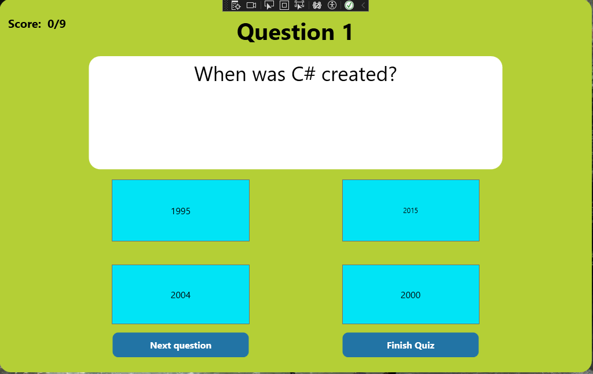
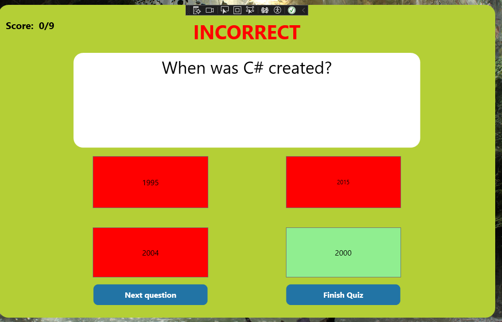

# Quiz-app
this is a quiz made for a group project using WPF in C# to make a desktop application
the user interface of the application was made using C# anf WPF to create the polished user interface shown.
this project was done to learn Object Oriented Programming as well as WPF design

# QuickStart

1. download repository
2. install Visual Studio 2019 or Above alongside, .NET runtimes for .NET 3 & 5
3. build and run application to view the desktop application

## Please note this app did have an installer but is not available due to self signed certificate issues causing installer problems and runtime errors
